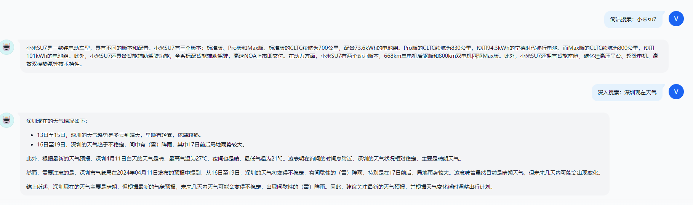
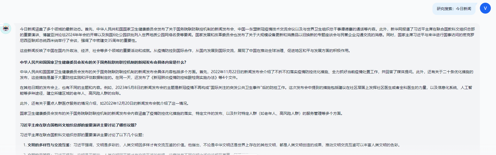
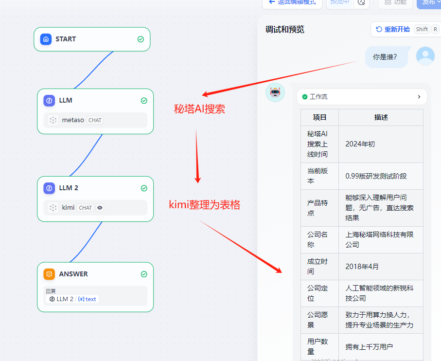
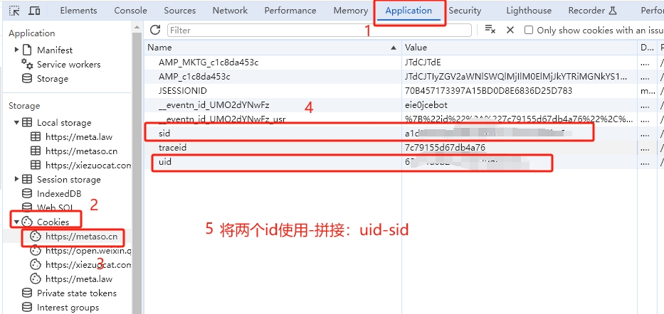

# Metaso AI Free 服务

[](LICENSE)


支持高速流式输出、支持秘塔AI超强联网搜索（全网or学术以及简洁、深入、研究三种模式），零配置部署，多路token支持。

与ChatGPT接口完全兼容。

还有以下六个free-api欢迎关注：

Moonshot AI（Kimi.ai）接口转API [kimi-free-api](https://github.com/LLM-Red-Team/kimi-free-api)

阶跃星辰 (跃问StepChat) 接口转API [step-free-api](https://github.com/LLM-Red-Team/step-free-api)

ZhipuAI (智谱清言) 接口转API [glm-free-api](https://github.com/LLM-Red-Team/glm-free-api)

阿里通义 (Qwen) 接口转API [qwen-free-api](https://github.com/LLM-Red-Team/qwen-free-api)

讯飞星火（Spark）接口转API [spark-free-api](https://github.com/LLM-Red-Team/spark-free-api)

聆心智能 (Emohaa) 接口转API [emohaa-free-api](https://github.com/LLM-Red-Team/emohaa-free-api)

## 目录

* [免责声明](#免责声明)
* [在线体验](#在线体验)
* [测试接口](#测试接口)
* [效果示例](#效果示例)
* [接入准备](#接入准备)
  * [多账号接入](#多账号接入)
* [Docker部署](#Docker部署)
  * [Docker-compose部署](#Docker-compose部署)
* [Render部署](#Render部署)
* [Vercel部署](#Vercel部署)
* [原生部署](#原生部署)
* [接口列表](#接口列表)
  * [对话补全](#对话补全)
  * [token存活检测](#token存活检测)
* [注意事项](#注意事项)
  * [Nginx反代优化](#Nginx反代优化)
  * [Token统计](#Token统计)
* [Star History](#star-history)

## 免责声明

**逆向API是不稳定的，建议前往秘塔AI官方 https://metaso.cn/ 使用，避免封禁的风险。**

**本组织和个人不接受任何资金捐助和交易，此项目是纯粹研究交流学习性质！**

**仅限自用，禁止对外提供服务或商用，避免对官方造成服务压力，否则风险自担！**

**仅限自用，禁止对外提供服务或商用，避免对官方造成服务压力，否则风险自担！**

**仅限自用，禁止对外提供服务或商用，避免对官方造成服务压力，否则风险自担！**

## 在线体验

此链接仅临时测试功能，如果遇到异常请稍后重试，建议自行部署使用。

https://udify.app/chat/46rRHl5xoVa4m1lo

## 效果示例

### 三种搜索模式（简洁、深入、研究）





### Dify工作流妙用



## 接入准备

从 [秘塔AI搜索](https://metaso.cn/) 获取`uid`和`sid`并使用`-`拼接：

进入秘塔AI搜索，登录账号（**建议登录账号，否则可能遭遇奇怪的限制**），然后F12打开开发者工具，从Application > Cookies中找到`uid`和`sid`的值。

将uid和sid拼接：`uid-sid`，如 `65e91a6b2bac5b600dd8526a-5e7acc465b114236a8d9de26c9f41846`。

这将作为Authorization的Bearer Token值：`Authorization: Bearer uid-sid`



### 多账号接入

**注意：目前怀疑秘塔对IP地址的总搜索次数有限制，建议加入IP轮换**

你可以通过提供多个账号的uid-sid并使用`,`拼接提供：

`Authorization: Bearer uid-sid1,uid-sid2,uid-sid3`

每次请求服务会从中挑选一个。

## Docker部署

请准备一台具有公网IP的服务器并将8000端口开放。

拉取镜像并启动服务

```shell
docker run -it -d --init --name metaso-free-api -p 8000:8000 -e TZ=Asia/Shanghai vinlic/metaso-free-api:latest
```

查看服务实时日志

```shell
docker logs -f metaso-free-api
```

重启服务

```shell
docker restart metaso-free-api
```

停止服务

```shell
docker stop metaso-free-api
```

### Docker-compose部署

```yaml
version: '3'

services:
  metaso-free-api:
    container_name: metaso-free-api
    image: vinlic/metaso-free-api:latest
    restart: always
    ports:
      - "8000:8000"
    environment:
      - TZ=Asia/Shanghai
```

### Render部署

**注意：部分部署区域可能无法连接metaso，如容器日志出现请求超时或无法连接，请切换其他区域部署！**
**注意：免费账户的容器实例将在一段时间不活动时自动停止运行，这会导致下次请求时遇到50秒或更长的延迟，建议查看[Render容器保活](https://github.com/LLM-Red-Team/free-api-hub/#Render%E5%AE%B9%E5%99%A8%E4%BF%9D%E6%B4%BB)**

1. fork本项目到你的github账号下。

2. 访问 [Render](https://dashboard.render.com/) 并登录你的github账号。

3. 构建你的 Web Service（New+ -> Build and deploy from a Git repository -> Connect你fork的项目 -> 选择部署区域 -> 选择实例类型为Free -> Create Web Service）。

4. 等待构建完成后，复制分配的域名并拼接URL访问即可。

### Vercel部署

**注意：Vercel免费账户的请求响应超时时间为10秒，但接口响应通常较久，可能会遇到Vercel返回的504超时错误！**

请先确保安装了Node.js环境。

```shell
npm i -g vercel --registry http://registry.npmmirror.com
vercel login
git clone https://github.com/LLM-Red-Team/metaso-free-api
cd metaso-free-api
vercel --prod
```

## 原生部署

请准备一台具有公网IP的服务器并将8000端口开放。

请先安装好Node.js环境并且配置好环境变量，确认node命令可用。

安装依赖

```shell
npm i
```

安装PM2进行进程守护

```shell
npm i -g pm2
```

编译构建，看到dist目录就是构建完成

```shell
npm run build
```

启动服务

```shell
pm2 start dist/index.js --name "metaso-free-api"
```

查看服务实时日志

```shell
pm2 logs metaso-free-api
```

重启服务

```shell
pm2 reload metaso-free-api
```

停止服务

```shell
pm2 stop metaso-free-api
```

## 接口列表

目前支持与openai兼容的 `/v1/chat/completions` 接口，可自行使用与openai或其他兼容的客户端接入接口，或者使用 [dify](https://dify.ai/) 等线上服务接入使用。

### 对话补全

对话补全接口，与openai的 [chat-completions-api](https://platform.openai.com/docs/guides/text-generation/chat-completions-api) 兼容。

**POST /v1/chat/completions**

header 需要设置 Authorization 头部：

```
Authorization: Bearer [token]
```

请求数据：
```json
{
    // 全网model名称支持 -> 简洁：concise / 深入：detail / 研究：research
    // 学术model名称支持 -> 学术-简洁：concise-scholar / 学术-深入：detail-scholar / 学术-研究：research-scholar
    // model乱填的话，可以通过tempature参数来控制（但不支持学术）：简洁：< 0.4 / 深入：>= 0.4 && < 0.7 / 研究：>= 0.7
    // model乱填的话，还可以通过消息内容包含指令来控制：↓↓↓
    // 简洁 -> 简洁搜索小米su7 / 深入 -> 深入搜索小米su7 / 研究 -> 研究搜索小米su7
    // 学术-简洁 -> 学术简洁搜索：小米su7 / 学术-深入 -> 学术深入搜索小米su7 / 学术研究 -> 学术研究搜索小米su7
    // 优先级：model > 消息内容指令 > tempature
    "model": "concise",
    "messages": [
        {
            "role": "user",
            "content": "秘塔AI"
        }
    ],
    // 如果使用SSE流请设置为true，默认false
    "stream": false
}
```

响应数据：
```json
{
    "id": "8466827997659213824",
    "model": "concise",
    "object": "chat.completion",
    "choices": [
        {
            "index": 0,
            "message": {
                "role": "assistant",
                "content": "秘塔AI搜索是上海秘塔网络科技有限公司在2024年初推出的一款新产品，被誉为中国版Perplexity。它利用自研的大模型MetaLLM，能够直接对用户的提问进行理解和回答，提供结构化、准确、直接的搜索结果，并明确列出来源参考，无需科学上网，解决了语言理解上的误差[[1]]。秘塔AI搜索通过其强大的语义理解能力和全网搜索功能，为用户提供了一个高效、无广告、信息丰富的搜索体验[[2]]。此外，秘塔AI搜索的特点包括没有广告，直达结果；结构化信息展示；以及信息来源追溯，为每条搜索结果提供了来源链接，用户可以轻松溯源验证信息的出处和可靠性[[4]]。秘塔科技成立于2018年4月，是一家新锐科技公司，致力于运用AI技术赋能专业场景，进行技术研发与产品落地[[3]]。\n"
            },
            "finish_reason": "stop"
        }
    ],
    "usage": {
        "prompt_tokens": 1,
        "completion_tokens": 1,
        "total_tokens": 2
    },
    "created": 1712859314
}
```

### token存活检测

检测token是否存活，如果存活live未true，否则为false，请不要频繁（小于10分钟）调用此接口。

**POST /token/check**

请求数据：
```json
{
    "token": "65e91a6b2bac5b600dd8526a-5e7acc465b114236a8d9de26c9f41846"
}
```

响应数据：
```json
{
    "live": true
}
```

## 注意事项

### Nginx反代优化

如果您正在使用Nginx反向代理metaso-free-api，请添加以下配置项优化流的输出效果，优化体验感。

```nginx
# 关闭代理缓冲。当设置为off时，Nginx会立即将客户端请求发送到后端服务器，并立即将从后端服务器接收到的响应发送回客户端。
proxy_buffering off;
# 启用分块传输编码。分块传输编码允许服务器为动态生成的内容分块发送数据，而不需要预先知道内容的大小。
chunked_transfer_encoding on;
# 开启TCP_NOPUSH，这告诉Nginx在数据包发送到客户端之前，尽可能地发送数据。这通常在sendfile使用时配合使用，可以提高网络效率。
tcp_nopush on;
# 开启TCP_NODELAY，这告诉Nginx不延迟发送数据，立即发送小数据包。在某些情况下，这可以减少网络的延迟。
tcp_nodelay on;
# 设置保持连接的超时时间，这里设置为120秒。如果在这段时间内，客户端和服务器之间没有进一步的通信，连接将被关闭。
keepalive_timeout 120;
```

### Token统计

由于推理侧不在metaso-free-api，因此token不可统计，将以固定数字返回。

## Star History

[](https://star-history.com/#LLM-Red-Team/metaso-free-api&Date)
